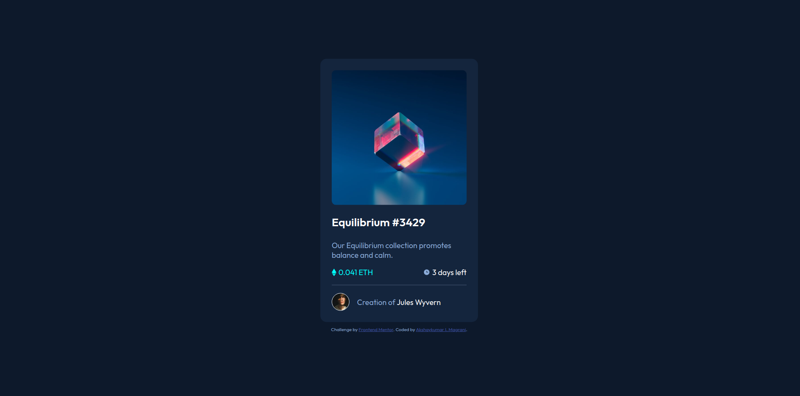

# Frontend Mentor - NFT preview card component solution

This is a solution to the [NFT preview card component challenge on Frontend Mentor](https://www.frontendmentor.io/challenges/nft-preview-card-component-SbdUL_w0U).

## Table of contents

- [Overview](#overview)
  - [The challenge](#the-challenge)
  - [Screenshot](#screenshot)
  - [Links](#links)
- [My process](#my-process)
  - [Built with](#built-with)
  - [What I learned](#what-i-learned)
  - [Continued development](#continued-development)
  - [Useful resources](#useful-resources)
- [Author](#author)
- [Acknowledgments](#acknowledgments)

**Note: Delete this note and update the table of contents based on what sections you keep.**

## Overview

### The challenge

Users should be able to:

- View the optimal layout depending on their device's screen size
- See hover states for interactive elements

### Screenshot



### Links

- Solution URL: [Solution URL](https://github.com/akshaymagrani/webDev-n-nft-preview-card-component-main)
- Live Site URL: [Live site URL](https://web-dev-n-nft-preview-card-component-main-nqybsz4v2.vercel.app/)

## My process

### Built with

- Semantic HTML5 markup
- CSS custom properties
- Flexbox

**Note: These are just examples. Delete this note and replace the list above with your own choices**

### What I learned

```css
.overlay {
        position: absolute;
        top: 0;
        bottom: 0;
        left: 0;
        right: 0;
        height: calc(100% - 1.2em);
        width: 100%;
        opacity: 0;
        border-radius: 10px;
        transition: .3s ease;
        background-color: hsla(var(--cyan-o), 0.6); /* to add opacity to background specifically, without affecting the icon */
        
    }
```
### Continued development

I will create a development branch off of this master branch to -
- reduce the CSS I have used without affecting the output.

### Useful resources

- [W3schools](https://www.w3schools.com/howto/howto_css_image_overlay_icon.asp) - This helped me to give the overlay of the icon on the image.

## Author

- Website - [Akshaykumar I. Magrani](https://www.your-site.com)
- Frontend Mentor - [@akshaymagrani](https://www.frontendmentor.io/profile/akshaymagrani)
- Twitter - [@akshaymagrani](https://www.twitter.com/akshaymagrani)
